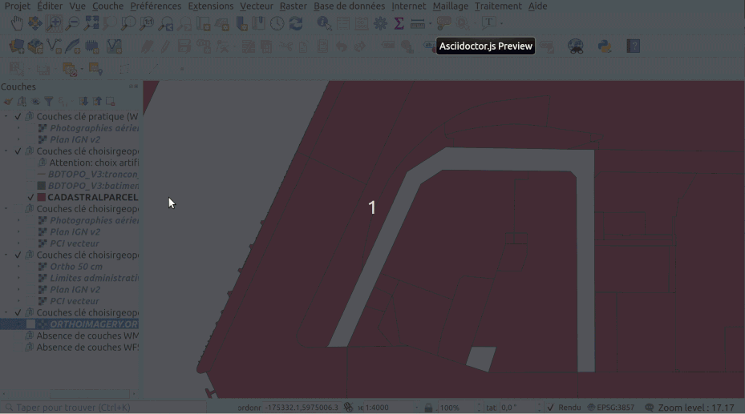
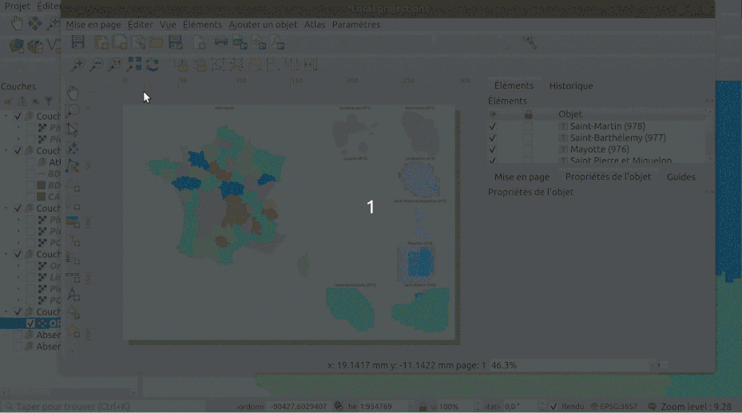
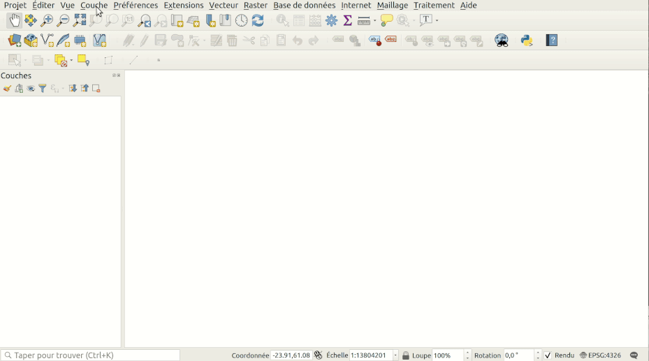
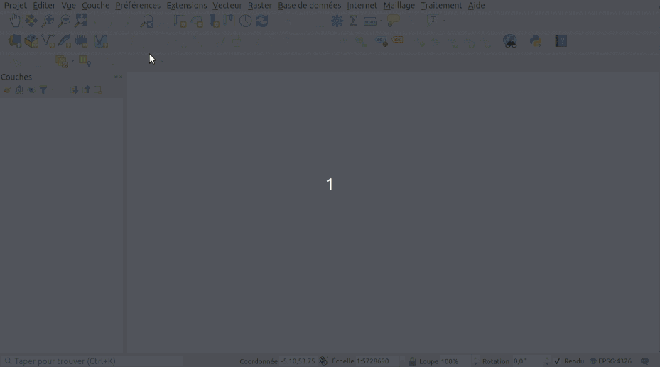

# Projet QGIS avec services WMS/WFS disponible à ce jour avec clé partagée

## But

Récemment, l'IGNF a mis à disposition des web services pour consommer certains de leurs fonds de plan et autres couches en utilisant une clé "partagée" alors qu'avant il fallait impérativement disposer d'une clé dédiée pour faire des tests.

Le but ici est de permettre de se rendre compte des ressources disponibles via ces clés.

Pour cela, nous avons fait un projet QGIS avec les différentes couches déjà chargées. Voir la démo ci-dessous:

L'interêt de la 2ème démo est de voir sur quel territoire une couche est disponible

Si vous cherchez une description textuelle des couches, allez sur la documentation officielle de l'IGNF https://geoservices.ign.fr/blog/2021/01/29/Maj_Cles_Geoservices.html

Ce qu'il faut retenir globalement et qu'il ne parait pas avoir toujours beaucoup de différence entre certaines couches WMTS et WMS. Il faut surtout noter qu'avec le WMS, on peut avoir une couche dans une projection locale correspondant à celle de la carte donc sans déformation des libellés par exemple. Cette souplesse es contrebalancée par la moindre performance par rapport à un WMTS, mis en cache.

Pour les couches WFS, il faut éviter de demander toutes les données France (nous avons mis un limite de seuil de zoom pour ne pas saturer QGIS, ni les serveurs de l'IGN "en face")

Dans certains cas, selon votre usage, il faut plutôt se diriger vers des données à télécharger sur votre propre poste. Les données sont sur https://geoservices.ign.fr/documentation/diffusion/telechargement-donnees-libres.html

*Attention!*: si vous consommez beaucoup d'appels ou souhaitez d'autres couches, ces clés ne suffiront pas à votre besoin. Nous reprenons la citation de la documentation officielle

> Ces clés partagées sont recommandées dans le cadre de test ou de développement et non dans un cadre de production. Aucune garantie de service n’y est en effet associée et ces clés peuvent être modifiées ou arrêtées à tout moment. Leur utilisation vous engage au respect des conditions d’utilisation des géoservices.

Pour commander une clé https://geoservices.ign.fr/documentation/diffusion/formulaire-de-commande-geoservices.html

Pour la liste des services et des couches mises à disposition en WMS, WMTS, WFS (et autres que nous n'abordons pas) https://geoservices.ign.fr/documentation/services-acces.html

## Importer la liste des services WMS et WFS dans QGIS

Deux fichiers:

* pour l'import WMS/WMTS [cles-ign-pratique-choisirgeoportail-choisirinspire-wmts-wms.xml](cles-ign-pratique-choisirgeoportail-choisirinspire-wmts-wms.xml)
* pour l'import WFS [cles-ign-choisirgeoportail-choisirinspire-wfs.xml](cles-ign-choisirgeoportail-choisirinspire-wfs.xml)

Voir l'import de la configuration WMS/WMTS dans le GIF ci-dessous

Voir l'ajout de WMS avec une projection locale, EPSG:2154 ici

Nous avons inclus les services avec la clé "choisirinspire" bien que pour le moment aucune couche ne soit présente dans le WMS et le WFS à ce jour en tablant sur l'apparition de couches ultérieurement.

## Projections utilisées (EPSG)

Dans le composeur avec la mise en page "Local projections"

* Métropole `EPSG:2154`
* Guadeloupe (971) `EPSG:5490`
* Martinique (972) `EPSG:5490`
* Guyane (973) `EPSG:2972`
* La Réunion (974) `EPSG:2975`
* Saint Pierre et Miquelon (975) `EPSG:4467`
* Mayotte (976) `EPSG:4471`
* Saint-Barthélemy (977) `EPSG:5490`
* Saint-Martin (978) `EPSG:5490`
